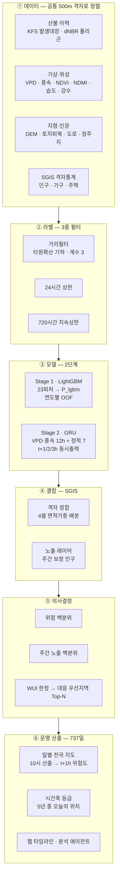

<div align="center">

# 산불 발화예측·우선대응 통합지도

**SGIS 통계지리 기반 500m 격자 의사결정 시스템**

전국 500m 격자의 향후 1~3시간 **산불 발화**를 AI로 예측하고,
여기에 **SGIS 인구·가구·주택 격자통계**를 결합해
"어디가 위험한가"를 넘어 **"어디를 먼저 지킬 것인가"** 에 답한다.

[데모](https://wildfire-predict-framework.vercel.app) ·
[아키텍처](#아키텍처) · [성능](#성능) · [실행](#실행) · [서비스 구조](#서비스-구조) ·
[SGIS API](#sgis-api-가용-범위) · [저장소 구조](#저장소-구조)


</div>

---

## 무엇을 하는가

| | |
|---|---|
| **입력** | 기상(VPD·풍속·습도·강수) · 위성 식생(NDVI·NDMI) · 지형 · 토지피복 · 인문환경 · SGIS 격자통계 |
| **모델** | Stage1 LightGBM(공간 취약도) → Stage2 GRU(12시간 시계열) |
| **출력** | 격자별 **t+1h · t+2h · t+3h** 신규 발화 위험 순위 |
| **결합** | 위험도 백분위 × SGIS **주간 보정** 노출 백분위 → 대응 우선지역 Top-N |
| **서비스** | 전 기간 737일 타임라인 · 사례 25일 시간대별 · 행정동 검색 · 분석 에이전트 |

출력은 **확률이 아니라 전국 상대 백분위**다. 학습에 재표본화를 써서 sigmoid 값을
발생확률로 읽을 수 없다. 화면·문서 모두 "전국 상위 N%"로만 표현한다.

---

## 규모

| 항목 | 실측값 |
|---|---|
| 분석 격자 | EPSG:5179 · 500m · 2130 × 2123 · 유효 **403,385셀** |
| 산불 사건 | 2021~2025년 2~6월 · **1,734건** |
| 화재 라벨 | 화재 셀 **2,090개** → 셀×시각 **17,085행** (24h 상한) |
| SGIS 격자통계 | 인구·가구·주택 500m 격자 · 2024 기준 |
| 노출 배분 | 총인구 **51,637,925명** (원본의 99.47%) |
| 지오코딩 복구 | **414/417건 (99.3%)** · 누락 피해면적의 100% |
| 전 기간 산출 | **737일** (2021~2025, 매년 2~6월) × 최대 4개 시각 |
| 시간대별 상세 | 사례 25일 (연도별 피해상위 3 + 무작위 2, seed 42) |
| SGIS 행정동 | 경계·인구특성 **3,559개** |

---

## 아키텍처



### 공통 격자 — 모든 것의 기준

```
common_mask_500m_5179.tif
  CRS      EPSG:5179 (Korea 2000 Unified, UTM-K)
  크기     2130 행 × 2123 열 · 해상도 500m
  원점     x = 414341.4294,  y = 2269364.0712
  유효셀   403,385개 (mask == 1)
```

픽셀 인덱스 ↔ 좌표 변환:

```
x = 414341.4294 + 500 × (pcol + 0.5)
y = 2269364.0712 − 500 × (prow + 0.5)
```

모든 피처 래스터가 이 마스크에 클립·정렬돼 있다. **격자는 바꾸지 않는다.**
SGIS를 포함한 외부 데이터는 전부 이쪽으로 끌어온다.

### 라벨 — 신규 발화 정의와 3중 필터

예측 대상은 화재의 **지속**이 아니라 **신규 발화**다. 이미 타고 있는 셀은 양성에서 제외한다.

| 필터 | 규칙 | 이유 |
|---|---|---|
| ① 거리필터 | 발화점 기준 타원확산 기하 · **계수 3** | 발화점에서 물리적으로 도달 불가능한 폴리곤 조각을 뺀다. 계수 3은 발화점을 타원의 후단 초점으로 두는 표준 확산모델에서 관측 상위 1% 풍속 조건에 대응하는 유도값이다 |
| ② 24시간 상한 | 발화 후 24시간까지만 양성 | 화재의 96.6%가 영향을 받지 않는다 |
| ③ 720시간 지속상한 | 지속 720시간 초과 기록 배제 | 종료시각 기록오류를 거른다 |

래스터화는 `all_touched`(교차하면 1)가 아니라 **셀 중심 포함** 규칙을 쓴다.
같은 폴리곤을 `all_touched`로 구우면 면적이 4.10배 과대 계상되는 반면,
셀 중심 규칙은 실측 대비 0.99배로 맞는다.

신고 피해면적 25ha 이상이고 dNBR 폴리곤이 있으면 폴리곤을 래스터화하고,
그 외에는 발화점 1픽셀만 양성으로 둔다.

### SGIS 격자 정합 — 면적가중 배분

분석 격자와 SGIS 격자통계는 정렬돼 있지 않다. 분석 셀 하나가 SGIS 셀 **4개**에 걸치며,
어긋난 양이 전 격자에서 동일해 배분 가중치가 **상수**다. 이를 면적가중으로 배분한다.

SGIS 격자경계 API로 강릉시·문경시·강남구의 격자 꼭짓점을 실측해 500 배수 정렬을 확인했고,
배포 SHP 418,728셀에서도 재확인했다. 마스크가 필요로 하는 셀의 **99.52%** 를 커버한다.

CSV에 없는 격자는 인구 0으로 본다(전국 합계가 실제 인구와 일치하므로 무인 지역으로 보는 것이
타당하다). 다만 **경계 파일에도 없는 격자**는 값을 모르는 것이므로 0이 아니라 결측으로 처리하고
해당 픽셀의 가중치를 남은 셀로 재정규화한다.

### 모델

```
Stage 1 — LightGBM (기존 연구 산출물)
  입력  23피처 (지형 5 · 토지피복 6 · 인문 4 · 기상 4 · 식생 2 · 계절 2)
  출력  P_lgbm — 해당 시점 공간 취약도
  누수  연도별 OOF — 그 해를 학습에 쓰지 않은 fold 모델이 그 해를 예측

Stage 2 — GRU (본 저장소, 배포 기본값 STAGE2_ARCH=gru_old)
  시계열  VPD · 풍속 × 12시간              shape (batch, 12, 2)
  정적    P_lgbm · NDVI · NDMI · hum4d · prcp4d · doy_sin · doy_cos   (7)
  인코더  nn.GRU(2 → 64, num_layers=2, dropout=0.3)
  헤드    Linear(64+7 → 64) → ReLU → Dropout → Linear(64 → 3) → Sigmoid
  출력    t+1h · t+2h · t+3h 동시
  검증    연도별 leave-one-year-out 5-fold
```

시각 규약 — `vpd_t0` = 대상시각 −1h 래스터, `vpd_tm{k}` = 대상시각 −(k+1)h,
예측 대상은 대상시각 +1h/+2h/+3h.

v4b CNN 대안은 검증했으나 채택하지 않았다. 근거는 [STAGE2_ABLATION.md](docs/STAGE2_ABLATION.md).

### 노출 — 주간 보정

우선순위의 노출항은 상주인구가 아니라 주간 보정 인구다.

```
day_idx   = (종사자 + 65세이상 + 15세미만) / 상주인구     전국 중앙값 0.77
pop_day   = pop_total × day_idx
expo_rank = pop_day 의 백분위
```

산불은 오후에 집중되는데 상주인구는 야간 기준이라 그대로 쓰면 시각이 어긋난다.
SGIS에 주간인구·통근 통계가 없어 종사자 통계로 근사한 **추정치**이며,
농작업이 사업체 등록에 잡히지 않아 농촌을 과소추정한다.
`EXPO_MODE=resident` 로 보정 전 동작으로 돌아갈 수 있다.

고령·노후주택은 산식에 넣지 않는다. 거주 격자끼리 비교하면 발화지의 고령비율
0.91배, 노후주택비율 0.89배로 상관이 없어 표시용으로만 쓴다.

### 대응 우선순위 산식

```
haz_rank  = 위험도 백분위 (0~100, 클수록 위험)
expo_rank = 주간 보정 노출 백분위 (0~100)
score     = 0.5 × haz_rank + 0.5 × expo_rank
```

두 백분위의 **단순 평균**이다. 단위가 다른 두 값을 곱하면 해석이 불가능해지므로
곱셈식을 쓰지 않았고, 가중치도 0.5:0.5로 고정해 불투명성을 없앴다.

산림-주거 인접지(WUI)로 한정한다 — **산림 비율 30% 이상 · 상주인구 10명 이상**.

### 시간축 위험등급

지도 등급은 그날 하루 안에서의 공간 백분위라 조용한 날에도 상위 1%가 나온다.
그래서 737일 전 기간의 **전국 평균 위험도**(`mean_prob`) 분포에서 오늘의 위치를 따로 잰다.

| 백분위 | 등급 |
|---|---|
| 90 이상 | 매우 높음 |
| 70~90 | 높음 |
| 40~70 | 주의 |
| 40 미만 | 보통 |

전국 최고 셀(`max_prob`)이 아니라 40만 셀 평균을 쓴다. 최고 셀 하나는 fold 모델 간
스케일 편차가 그대로 실리는 반면, 평균은 편차가 상쇄돼 표본 크기에 안정적이다.

### 설명가능성 — occlusion 기여도

SHAP 대신 occlusion을 쓴다. 입력이 12시간 시계열이라 "최근 몇 시간 중 어느 시점이
결정적이었나"가 곧 대응 판단에 쓰이는 답이기 때문이다.

```
시간축   각 시점을 그 격자 자신의 12시간 평균으로 덮고 출력 변화를 잰다
정적     각 피처를 그 시각 WUI 격자의 중앙값으로 덮고 출력 변화를 잰다
기여도   원래 출력 − 덮은 뒤 출력   (양수면 위험을 올린 요인)
```

정적 기준선에 전국 중앙값이 아니라 WUI 중앙값을 쓴다. 전국 기준이면
"산림 인접지치고 어떤가"가 아니라 "전국 평균 대비"가 되어 해석이 흐려진다.

Top-N 격자에 대해 1 + 12 + 7 = 20개 변형을 한 번의 추론으로 묶어 계산 비용이 사실상 없다.

---

## 성능

### 신규발화 GRU — 연도별 leave-one-year-out 5-fold

| horizon | AUROC | AUPRC | 평균 기저율 | 기저율 대비 리프트 |
|---|---|---|---|---|
| t+1h | **0.837** | 0.142 | 2.97% | **5.15배** |
| t+2h | 0.826 | 0.127 | 2.96% | 4.57배 |
| t+3h | 0.807 | 0.115 | 2.96% | 4.06배 |

리프트는 fold별 기저율(1.94~4.24%)로 각각 나눈 뒤 평균한 값이다.
기저율이 fold마다 달라 AUPRC 절대값을 fold 사이에서 직접 비교해서는 안 된다.

### 전국 격자를 상대로 한 실전 순위

실제 발화 **1,308건** 전수. 각 사건이 가장 높게 잡힌 시각 기준으로 집계한다.

| 구간 | 포착률 | 무작위 대비 |
|---|---|---|
| 전국 상위 1% | **6.0%** | 6.0배 |
| 전국 상위 5% | 16.8% | 3.4배 |
| 전국 상위 10% | 26.0% | 2.6배 |
| 전국 상위 20% | 40.0% | 2.0배 |

피해규모가 클수록 순위가 높다 — 100ha 이상 중앙값 **10.5%**, 0.5ha 미만 30.2%.
예보 시계가 멀어질수록 날카로운 쪽이 먼저 무너진다(상위 1%: t+1h 6.0% → t+3h 3.3%).

> **읽는 법.** "여기서 불이 난다"를 맞히는 도구가 아니라 **한정된 진화 자원을 어디에
> 먼저 배치할지 좁혀주는 도구**다. 상위 1%는 전국 4,034셀, 상위 5%는 20,169셀이다.

### 시간축 위험등급

지도의 등급은 그날 하루 안에서의 공간 백분위라, 발화 0건인 조용한 날에도 상위 1%는
항상 나온다. 그래서 737일 분포에서 오늘의 위치를 따로 잰다.

| 시간축 구간 | 일수 | 평균 발화 | 평균 피해 | 발화 0건인 날 |
|---|---|---|---|---|
| 하위 25% | 186 | 0.15건 | 0.01 ha | **161일** |
| 25–50% | 185 | 0.85건 | 0.24 ha | 100일 |
| 50–75% | 185 | 2.54건 | 29.9 ha | 37일 |
| **상위 25%** | 185 | **5.82건** | **156.4 ha** | **4일** |
| (등급 `매우 높음`) | 114 | 6.54건 | — | **0일** |

발화건수와의 스피어만 상관 **0.769**.

상세 검증 과정과 ablation 은 [METHODOLOGY.md](docs/METHODOLOGY.md) ·
[STAGE2_ABLATION.md](docs/STAGE2_ABLATION.md).

---

## 실행

```bash
# ① SGIS 지오코딩 복구 — 다른 단계의 입력
python scripts/30_recover_failed_geocodes.py
python scripts/30b_recover_remaining.py
python scripts/30c_recover_sigu.py

# ② 격자 정합 (SGIS 자료 수령 후)
python scripts/22_sgis_grid_weights.py
python scripts/26_build_mask_to_sgis_lookup.py
python scripts/28_build_gridcd_lookup.py
python scripts/29_build_exposure_layer.py

# ③ 화재 라벨 · 행정동 · SGIS 인구특성
python scripts/40_build_fire_cell_index.py
python scripts/41_build_cell_admin_lookup.py
python scripts/64_build_adm_boundaries.py
python scripts/65_fetch_sgis_vulnerability.py

# ④ 모델
python scripts/24_train_gru_ignition_5fold.py

# ⑤ 추론 · 사례일
$env:TARGET_DT='2025-03-22 12:00'; python scripts/32_fullgrid_inference_ignition.py
$env:DATE='2025-03-22';            python scripts/35_case_replay.py

# ⑥ 전 기간 스캔 — 시각당 약 4~5시간. 마지막은 접미사 없이 돌려야 통합 CSV 가 갱신된다
$env:FORCE='1'; $env:REGION_AGG='1'; $env:SCAN_HOURS='10'; $env:OUT_SUFFIX='_h10'
python scripts/51_daily_scan_full_period.py

# ⑦ 웹 자산
python scripts/52_select_case_days.py
python scripts/53_build_multiday_assets.py
python scripts/54_time_axis_risk.py
python scripts/55_build_timeline_index.py
python scripts/56_build_region_daily.py
```

### 웹

```bash
cd web && npm install && npx next build && npx next start -p 3100
```

개발 서버(`npm run dev`)는 이 환경에서 하이드레이션에 실패하므로 프로덕션 빌드로 확인한다.
분석 에이전트에는 `GEMINI_API_KEY` 가 필요하다.

### 주요 환경변수

| 변수 | 기본 | 설명 |
|---|---|---|
| `STAGE2_ARCH` | `gru_old` | `gru_old` / `cnn` / `gru` |
| `STAGE2_RATIO` · `STAGE1_RATIO` | `20` | 재표본화 비율 |
| `EXPO_MODE` | `day` | `day`(주간 보정) / `resident` |
| `SCAN_HOURS` · `OUT_SUFFIX` · `FORCE` | — | 51번 스캔 제어 |
| `REGION_AGG` | — | `1` 이면 행정동 집계도 저장 |

---

## 서비스 구조

### 두 가지 모드

| | 전 기간 737일 | 시간대별 상세 (사례 25일) |
|---|---|---|
| 산출 시각 | 매일 10시 → t+1h(11시) | 06~18시 13개 시각 |
| 지도 | 일별 PNG 1장 | 시각별 PNG 13장 + 벡터 셀 |
| 우선지역 | 없음 (격자 단위 값 미저장) | Top 10 + occlusion 근거 |
| 공간질의 | 행정동 집계(시군구까지) | 격자에서 직접 집계 |

전 기간에 격자 단위 값을 저장하지 않는 것은 용량 때문이다. 737일 × 403,385셀을
그대로 두면 수십 GB가 된다. 일별 집계 한 줄과 지도 PNG만 남긴다.

### 웹 자산

| 파일 | 용량 | 내용 |
|---|---|---|
| `days.json` | 5KB | 사례 25일 목록 · 등급 정의 · 지도 코너 좌표 |
| `cells.json` | 3.0MB | 사례일 공용 벡터 셀 **55,023개**(WUI 한정) — bbox · 행정동명/코드 · 인구·가구·주택 |
| `timeline.json` | 200KB | 737일 일별 요약 (등급 · 노출 · 발화 좌표) |
| `time_risk.json` | 76KB | 시간축 위험등급 |
| `region_daily.json` | 3.8MB | 행정동 일별 집계 (시도 전부 · 상위 시군구 · 상위 동 20) |
| `adm_dong.geojson` | 6.3MB | SGIS 행정동 경계 3,559개 (80m 단순화, gzip 1.3MB) |
| `adm_index.json` | 368KB | 시도→시군구→동 인덱스 (bbox · 대표점) |
| `d/{YMD}/` | 50MB | 사례일 자산 — `hazard_{HH}.png` 13장 · `values.json` · `priority.json` · `fires.json` · `meta.json` |
| `daily/` | 21MB | 전 기간 일별 지도 PNG 737장 |

지도 PNG는 EPSG:3857로 재투영해 굽는다. 전 기간은 4배 다운스케일(약 2km/픽셀),
사례일은 2배다. 클릭 가능한 벡터 셀은 사례일에만, 그중에서도 WUI 격자만 올린다 —
40만 셀을 전부 벡터로 내보내면 브라우저가 감당하지 못한다.

### 분석 에이전트

화면 컨텍스트와 **공간질의 결과**를 함께 실어 LLM에 넘긴다.
질문에서 지역명을 찾아 미리 집계하므로 함수호출 왕복이 없다 — API 예산이 25초라
왕복을 하나 더 넣을 여유가 없다.

```
사례일 상세   cells.json + values.json 으로 격자에서 직접 집계
전 기간       region_daily.json (행정동 집계) — 시군구·시도 단위까지만
```

지역 매칭은 좁은 단위 우선(동 > 시군구 > 시도)이며, 동 이름은 중복되므로
상위 지명이 함께 언급됐을 때만 확정한다. 시도는 약칭(경북 등)도 받는다.

프롬프트에 못박은 규칙 — 출력을 "확률"이라 부르지 않을 것, 화면에 없는 수치를
지어내지 말 것, 주간인구의 농촌 과소추정 한계를 함께 밝힐 것,
"고령자가 많은 곳이 산불이 잘 나느냐"는 질문에는 아니라고 답할 것.

---

## SGIS API 가용 범위

재현하려는 사람을 위해 **되는 것과 안 되는 것**을 구분해 남긴다.
베이스 `https://sgisapi.mods.go.kr/OpenAPI3/`, 인증키는 `.env` 의
`SGIS_CONSUMER_KEY` / `SGIS_CONSUMER_SECRET`.

| 있음 | 용도 |
|---|---|
| `addr/geocode` · `addr/rgeocode` · `addr/stage` | 좌표 결측 복구 (3단계 조회) |
| `stats/population` | 행정동 평균연령 · 노년부양비 · 노령화지수 · 인구밀도 · 사업체·종사자 |
| `stats/searchpopulation` + `age_type` | **22 유년(0~14) / 23 생산연령 / 24 고령(65+)** |
| `stats/household` · `stats/house` · `stats/company` | 가구 · 주택 · 사업체 |
| `boundary/hadmarea.geojson` | 행정동 경계 |
| `themamap/CTGR_00N/{list,data}` | 통계주제도 33종 |
| 자료제공 (신청 후 다운로드) | 500m 격자통계 · 격자경계 SHP |

| 없음 | 대안 |
|---|---|
| 격자통계 API (`stats/grid` 류) | 자료제공 다운로드가 유일한 경로 |
| 통근·주간인구 (`stats/commute`, `daytimepopulation`) | 종사자수로 근사 |
| 집계구 경계·통계 | — |

`age_type` 코드는 문서에 없어 전수 탐색으로 확정했다. 세 값의 합이 총인구와
정확히 일치하고 노년부양비·노령화지수와도 맞는 것으로 검증했다.

> **함정** — `themamap` 은 `stat_thema_map_id` 가 틀려도 `errMsg: Success` 에
> 빈 배열을 돌려준다. 수집 스크립트에 "한 건도 못 받으면 중단" 가드를 넣어 두었다.

> `adm_cd` 는 법정동코드가 아니라 **SGIS 자체 코드**다. 시도 코드도 표준 코드와
> 다르다(11·21·22…39). 표준 코드표로 잇지 말 것.

---

## 재실행 비용

| 작업 | 소요 | 병목 |
|---|---|---|
| 지오코딩 복구 414건 | 6초 | SGIS API |
| 격자 대응표 · 노출 레이어 | 1분 | 로컬 계산 · CSV 파싱 |
| SGIS 인구특성 수집 (65번) | 약 8분 | API 1,500여 회 |
| 행정동 경계 자산 (64번) | 20초 | 지오메트리 단순화 |
| GRU 5-fold 학습 | 6.4분 | CPU |
| 전국 격자 추론 1시각 | 0.6분 | NAS 래스터 읽기 |
| 사례 replay 1일 13시각 | 1.5분 | 래스터 캐시로 75개만 읽음 |
| 사례 25일 재생성 | 약 40분 | 〃 |
| **전 기간 스캔 1시각 × 737일** | **약 4~5시간** | **NAS SMB 왕복지연** |
| 웹 자산 재빌드 (53~56번) | 약 4분 | PNG 인코딩 |

NAS 접근이 압도적 병목이다. 점 단위 추출이 많은 작업은 파일 접근을 전역으로 합쳐
병렬화했고, 전국 격자를 다 읽는 작업은 반대로 전체 배열 읽기가 유리하다.
사례 replay 는 인접 시각이 12랙 중 11개를 공유한다는 점을 이용해 캐시한다.

**위험도가 바뀌지 않는 변경**(노출 정의·요약 컬럼)은 지도 PNG를 다시 굽지 않아도 된다.
`DUMP_PNG` 를 켜지 않으면 그만큼 시간이 준다.

---

## 저장소 구조

```
wildfire_predict_framework/
├── scripts/                     분석 파이프라인
│   ├── 20~25_*.py                 라벨 감사 · 발화직전 마커 · 학습셋 · GRU 5-fold
│   ├── 26~29_*.py                 격자 대응표 · GRID_CD 매핑 · 노출 레이어
│   ├── 30~30c_*.py                SGIS 지오코딩 복구 (3단계)
│   ├── 32_fullgrid_inference_*.py 전국 격자 추론
│   ├── 34_priority_final.py       대응 우선순위 (WUI 한정)
│   ├── 35_case_replay.py          시간대별 사례 replay + occlusion 기여도
│   ├── 40~41_*.py                 화재 셀-시간 인덱스 · 격자→행정동
│   ├── 51_daily_scan_full_period.py  전 기간 737일 스캔 (+ 행정동 집계)
│   ├── 52~56_*.py                 사례일 선정 · 웹 자산 · 시간축 등급 · 타임라인 · 지역 집계
│   ├── 60~63_*.py                 v4b CNN 구조 검증 · 재현 · 재학습 · A/B 비교
│   ├── 64~65_*.py                 SGIS 행정동 경계 · 인구특성 수집
│   ├── 67~69_*.py                 보고서 그림 · 문서 · UI 캡처
│   ├── _stage2_model.py           Stage1+Stage2 로드 (32·35·51 공유)
│   └── _exposure.py               격자별 노출 · 주간 보정 (35·51 공유)
├── web/                         Next.js + MapLibre 프런트엔드
│   ├── src/pages/index.tsx        전 기간 모드 · 시간대별 상세 모드
│   ├── src/components/            RegionPicker · ChatPanel · WhyPanel
│   ├── src/lib/spatialQuery.ts    분석 에이전트 공간질의
│   └── public/data/               타임라인 · 일별 PNG · 사례일 자산
├── docs/
│   ├── ARCHITECTURE.md            데이터 흐름 · 스크립트 의존관계 · 재실행 비용
│   ├── METHODOLOGY.md             라벨 필터 · 격자 정합 · 우선순위 규칙
│   ├── STAGE2_ABLATION.md         모델 선택 근거
│   └── REPORT.md                  공모전 보고서 원고
├── outputs/                     성능 결과표 · 그림 · 실행 로그
└── data/                        (미포함 — 원 권리는 각 제공기관)
    └── grid_data/derived/         결과표·파라미터만 공개
```

`data/` 는 1.8GB이고 원 권리가 각 제공기관에 있어 포함하지 않는다.
SGIS 격자통계·격자경계는 [자료제공](https://sgis.mods.go.kr/view/pss/openDataIntrcn)에서 신청한다.
재현에 필요한 격자 정합 가중치·거리필터 로그·결과표는 `data/grid_data/derived/` 에 포함했다.

---

## 데이터 출처

| 데이터 | 출처 | 이용 |
|---|---|---|
| 500m 격자통계 (인구·가구·주택) | 국가데이터처 SGIS 자료제공 | 무료 · 신청 후 다운로드 |
| 500m 격자경계 · 행정동 경계 | 국가데이터처 SGIS | 무료 · SHP |
| 지오코딩 · 행정구역 · 인구특성 · 통계주제도 | SGIS OpenAPI | 무료 · 1일 5만 회 |
| 산불 발생대장 | 산림청 | 과제 내부 |
| dNBR 피해 폴리곤 | Sentinel-2 · Google Earth Engine | 과제 내부 |
| 기상 (VPD·풍속·습도·강수) | 기상청 | 과제 내부 |
| 식생 (NDVI·NDMI) | MODIS MOD09A1 | NASA |
| 지형·토지피복·도로·정주지 | 국토지리정보원 · 환경부 · 국토교통부 | 과제 내부 |

> SGIS 통계 비공개 처리 — 인구부문은 값이 5 미만이면 0/5/8로 치환된다.
> 침엽수 80% 이상 격자의 **71.7%** 가 이 구간이라, 산불 위험지역일수록 개별 값의
> 상대오차가 크다. 저인구 격자에는 품질 플래그를 함께 저장한다.

---

## 한계

1. **주간인구는 추정치다.** 농작업이 사업체 등록에 잡히지 않아 농촌을 과소추정한다.
2. **소형 화재 식별력이 낮다.** 0.5ha 미만은 순위 중앙값 30.2%다.
3. **평가에서 빠진 발화가 있다.** 하루 4개 시각만 스캔해 심야·저녁 발화 일부가 미평가다.
4. **확률 보정 미완.** 재표본화 때문에 출력을 발생확률로 쓸 수 없다.
5. **입력 데이터가 2025년 6월에서 끝난다.** 시간별 기상 래스터 보유 범위 때문이다.
6. **전 기간 모드는 격자 단위 값을 저장하지 않는다.** 공간질의가 시군구까지만 답한다.
7. **`damagearea` 는 최종 피해면적이 아니다.** 발화 신고시점 기록이다.

---

## 라이선스

코드는 [MIT](LICENSE). 수집·가공 데이터의 원 권리는 각 제공기관에 있으며 재이용 조건은 각 기관 고지를 따른다.
SGIS OpenAPI 인증키는 [API 이용약관](https://sgis.mods.go.kr/developer/html/newOpenApi/app/rules.html) 제4조에 따라
발급받은 자만 이용할 수 있고 타인과 공유할 수 없다.
